<!-- ===================== ANIMATED HEADER ===================== -->
<div align="center">


<a href="https://github.com/ashrithBalaji456/Sai_Ram_Portfolio">
  
</a>

<br/>

[](https://sai-ram-portfolio.vercel.app/)
[](https://github.com/ashrithBalaji456/Sai_Ram_Portfolio)


</div>

---

## 📑 Table of Contents

- [✨ About](#-about)
- [🌐 Live Demo](#-live-demo)
- [🧰 Tech Stack](#-tech-stack)
- [🏗️ Architecture](#️-architecture)
- [🔄 Workflows](#-workflows)
- [📊 Data & Charts](#-data--charts)
- [📁 Project Structure](#-project-structure)
- [🚀 Getting Started](#-getting-started)
- [📜 Available Scripts](#-available-scripts)
- [🌍 Deployment](#-deployment)
- [🙏 Credits, License & Usage Notice](#-credits-license--usage-notice)
- [📬 Contact](#-contact)

---

## ✨ About

This repository contains the source code of the personal portfolio website of **Moogala Sairam** — a Software Engineer specializing in **Java, Python, Spring Boot, REST APIs, and Relational Databases**.

The site is a front-end showcase built with **React + TypeScript**, animated with **GSAP**, and rendered with **Three.js / React Three Fiber (WebGL)** for interactive 3D visuals. It is bundled by **Vite** and hosted on **Vercel**.

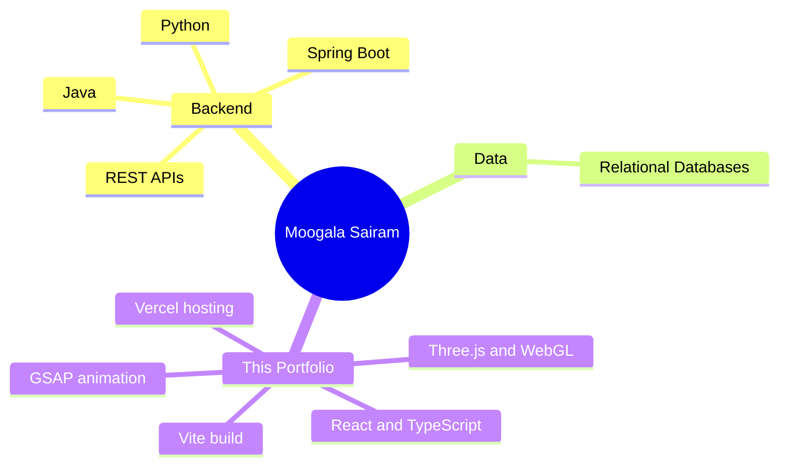

---

## 🌐 Live Demo

| | |
|---|---|
| 🔗 **Live URL** | [https://sai-ram-portfolio.vercel.app/](https://sai-ram-portfolio.vercel.app/) |
| 📦 **Source** | [github.com/ashrithBalaji456/Sai_Ram_Portfolio](https://github.com/ashrithBalaji456/Sai_Ram_Portfolio) |
| 🌿 **Default branch** | `main` |

---

## 🧰 Tech Stack

> Versions below are the ranges declared in `package.json`.

| Layer | Technology | Declared version |
|---|---|---|
| UI framework | React, React DOM | `^18.3.1` |
| Language | TypeScript | `^5.5.3` |
| Build tool | Vite, `@vitejs/plugin-react` | `^5.4.1`, `^4.3.1` |
| Animation | GSAP, `@gsap/react` | `^3.15.0`, `^2.1.1` |
| 3D / WebGL | three, `@react-three/fiber`, `@react-three/drei`, `@react-three/postprocessing`, three-stdlib | `^0.168.0`, `^8.17.10`, `^9.120.4`, `^2.16.3`, `^2.33.0` |
| Physics | `@react-three/rapier`, `@react-three/cannon` | `^1.5.0`, `^6.6.0` |
| UI extras | react-icons, react-fast-marquee | `^5.3.0`, `^1.6.5` |
| Analytics | `@vercel/analytics` | `^1.4.1` |
| Linting | ESLint 9, typescript-eslint, react-hooks and react-refresh plugins | `^9.9.0` |
| Hosting | Vercel | — |

---

## 🏗️ Architecture

How the libraries in this project fit together at runtime:

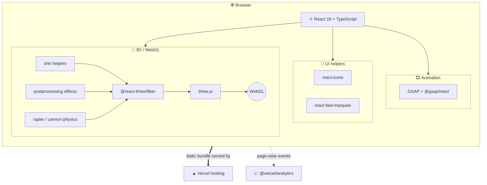

### Request lifecycle

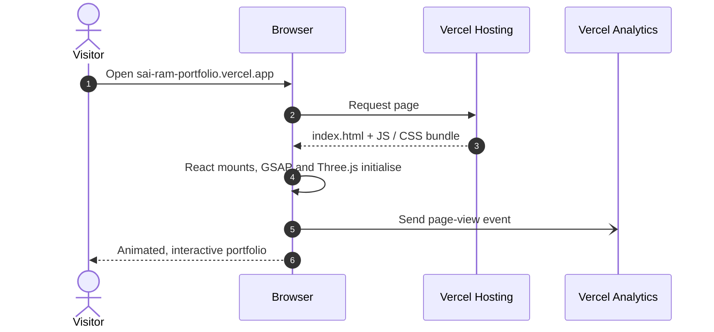

---

## 🔄 Workflows

### 1. Development workflow

Each step maps to a script defined in `package.json`.

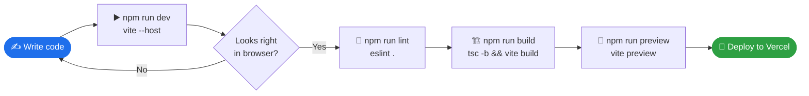

### 2. Build pipeline

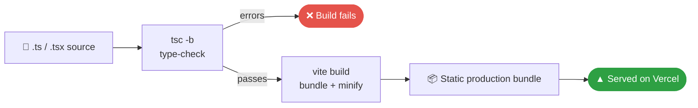

### 3. Suggested Git workflow

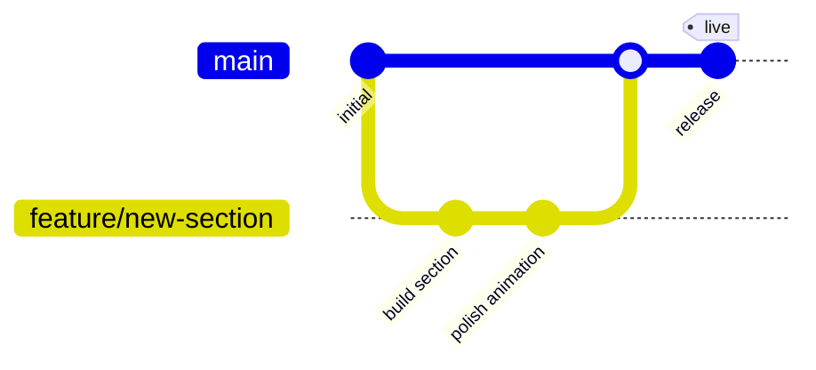

### 4. Release lifecycle

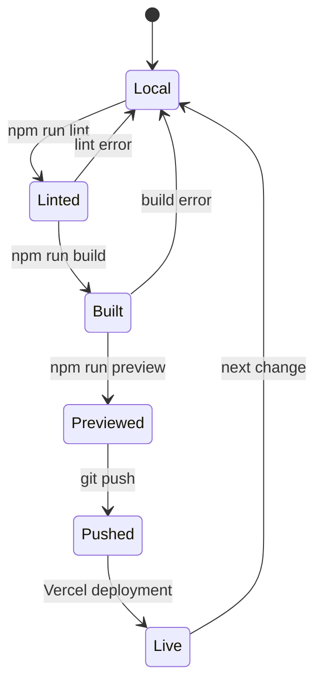

---

## 📊 Data & Charts

> All numbers in this section were counted directly from this repository's `package.json` (15 runtime dependencies + 12 dev dependencies = 27 packages). They will drift as dependencies change.

### Runtime dependencies by category (15)

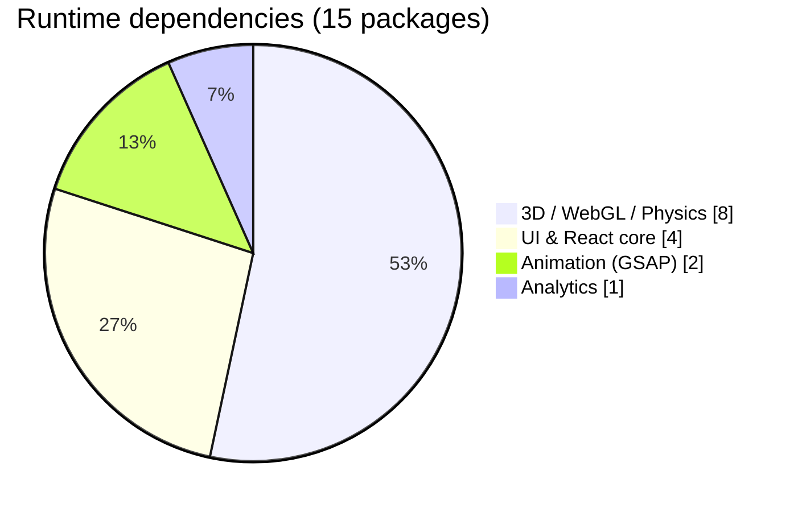

### Dev dependencies by category (12)

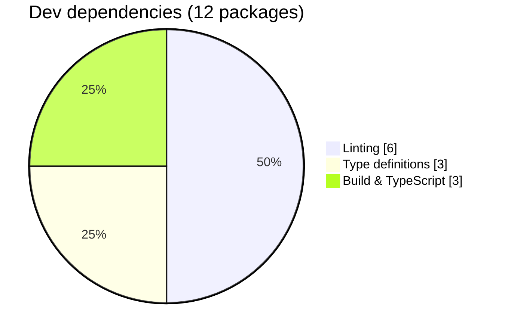

### All packages by category (27)

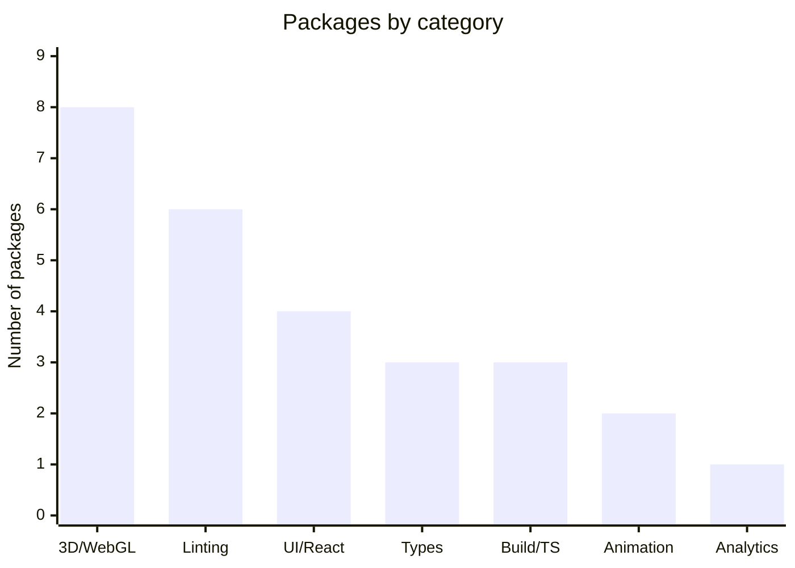

### Dependency split

| Group | Count | Share of total |
|---|---:|---:|
| Runtime (`dependencies`) | 15 | ≈ 56% |
| Development (`devDependencies`) | 12 | ≈ 44% |
| **Total** | **27** | **100%** |

### Live repository metrics

These widgets pull current data from GitHub each time the page loads.

<div align="center">


</div>

---

## 📁 Project Structure

Top-level layout of the repository:

```text
Sai_Ram_Portfolio/
├── .github/
│   └── workflows/          # GitHub Actions workflows
├── public/                 # Static assets served as-is
├── src/                    # Application source (React + TypeScript)
├── .gitignore
├── eslint.config.js        # ESLint flat config
├── index.html              # Vite entry HTML
├── LICENSE                 # Personal Portfolio License (PPL) v1.0
├── package.json            # Scripts and dependencies
├── package-lock.json
├── README.md
├── test.js
├── tsconfig.json           # TS project references
├── tsconfig.app.json       # TS config for app code
├── tsconfig.node.json      # TS config for tooling
└── vite.config.ts          # Vite configuration
```

---

## 🚀 Getting Started

### Prerequisites

- **Node.js** and **npm** (a current LTS release is recommended)
- **Git**

### Installation

```bash
# 1. Clone the repository
git clone https://github.com/ashrithBalaji456/Sai_Ram_Portfolio.git

# 2. Move into the project
cd Sai_Ram_Portfolio

# 3. Install dependencies
npm install

# 4. Start the dev server
npm run dev
```

The dev script runs `vite --host`, so the site is also reachable from other devices on your local network. Vite prints the exact local URL in the terminal.

---

## 📜 Available Scripts

| Command | What it runs | Purpose |
|---|---|---|
| `npm run dev` | `vite --host` | Start the dev server with hot reload |
| `npm run build` | `tsc -b && vite build` | Type-check, then create a production bundle |
| `npm run lint` | `eslint .` | Lint the whole project |
| `npm run preview` | `vite preview` | Serve the production build locally |

---

## 🌍 Deployment

The site is live at **[sai-ram-portfolio.vercel.app](https://sai-ram-portfolio.vercel.app/)** and hosted on **Vercel**. Page-view analytics use `@vercel/analytics`.

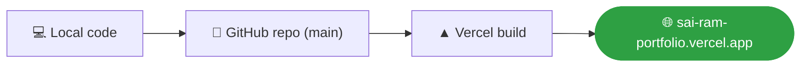

---

## 🙏 Credits, License & Usage Notice

- **License:** This project is licensed under the **Personal Portfolio License (PPL) v1.0**. See the [`LICENSE`](./LICENSE) file for the full terms.
- **Original work:** The earlier version of this README credited **Moncy Yohannan** as the author of the open-source portfolio this project's code and design are based on. Credit and a link back to the original repository should be kept here: `ORIGINAL_REPO_URL_HERE`.
- **Usage notice (summary):** The original author shares this code for learning only. Cloning or replicating the full site/design, reposting it with minor content changes, using it for commercial or client work, or making tutorials from it is not permitted. If you reuse parts of the code, credit the original repository.
- **GSAP:** Some GSAP Club plugins were modified using trial versions, which cannot be used for production hosting. Official plugins: <https://gsap.com/docs/v3/Installation/>.
- **3D assets:** Some bundled 3D assets are free for learning use. The original author's custom 3D avatar is not open source and must not be extracted or reused.

---

## 📬 Contact

<div align="center">

[](https://sai-ram-portfolio.vercel.app/)
[](https://github.com/ashrithBalaji456)

**⭐ If you found this useful for learning, consider starring the repo!**


</div>
